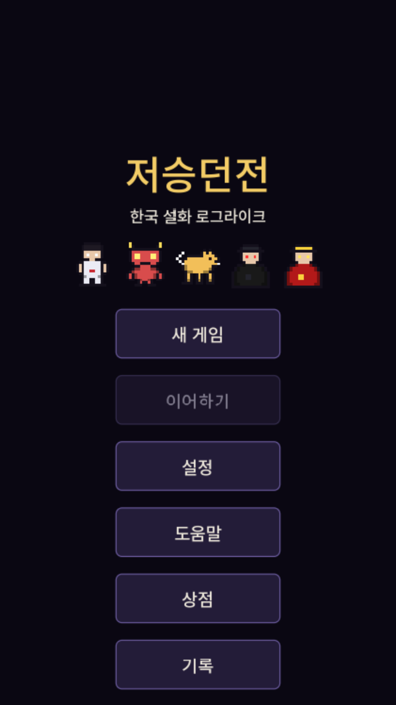
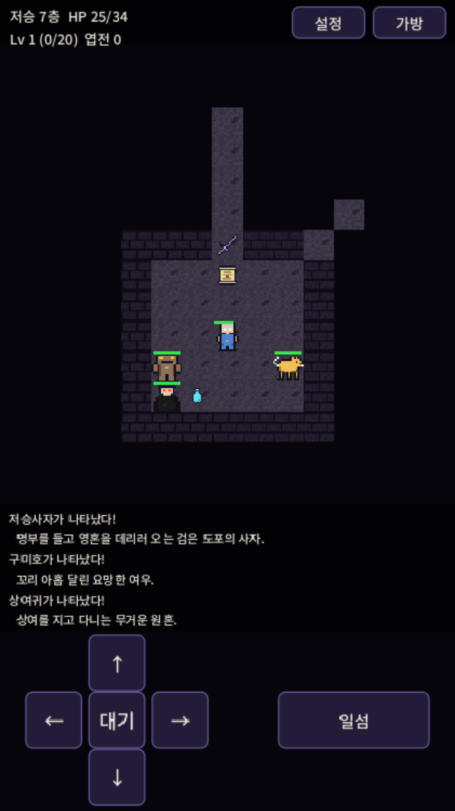

# 저승던전 (Jeoseung Dungeon)

한국 설화 기반 턴제 로그라이크 던전 크롤러. Godot 4.7.1 / GDScript, 모바일(Android/iOS) 타겟.
Shattered Pixel Dungeon에서 장르 영감만 받았고, 코드/아트/이름은 전부 오리지널입니다
(SPD는 GPL-3.0이라 코드·에셋을 가져오면 안 됩니다).

 

## 실행
- 에디터: Godot 4.7.1로 `project.godot` 열기 -> F5 (메인 메뉴에서 시작)
- 조작: 방향키/WASD 이동(적에게 부딪히면 공격), Space 대기, E/Q 기술, I 가방. 모바일은 화면 D-pad와 기술 버튼.
- 헤드리스 검증:
  - `Godot --headless --path . res://tests/SmokeTest.tscn` (로직 스모크 테스트, 실패 시 exit 1)
  - `Godot --headless --path . res://tests/BalanceSim.tscn` (클래스별 봇 밸런스 시뮬레이션, 약 5분)

## 구현 현황
### Phase 1 (완료)
- 절차적 던전(방+복도), 턴제 전투, 아이템 감정, 장비, 레벨업, 자연 회복, 모바일 UI
- 데이터 주도: 아이템/몬스터/클래스는 `resources/**/*.tres` (스크립트 수정 없이 추가 가능)

### Phase 2 (완료)
- 클래스 3개: 무당(살풀이/회복), 화랑(일섬/3배 근접), 도사(뇌전/범위 피해) - 클래스별 기술과 재사용 대기
- 던전 20층, 중간 보스 강림차사(10층), 최종 보스 염라대왕(20층)
- 몬스터 17종(보스 2 포함), 아이템 16종(층별 등장 제한 `min_floor`), 축지/천리안 부적, 영약(최대 체력 영구 증가)
- 시야/안개(Bresenham 시야, 탐험한 곳 기억), 문(시야 차단, 밟으면 열림), 숨은 함정(가시/순간이동)
- 원거리 몬스터는 시야가 있어야 공격
- 저장/이어하기: 층 진입 시 자동 저장(`user://save.json`), 사망/클리어 시 삭제(영구 사망)
- 메인 메뉴 + 직업 선택 화면
- 봇 시뮬레이션 기준 클리어율 약 37% (무당 3/8, 화랑 2/8, 도사 4/8, 상태이상 도입 후). 봇은 사람보다 못하므로 실제는 더 쉬울 수 있음

### Phase 3 (진행 중)
- 사운드: `python tools/gen_audio.py` 로 효과음 17종 + 음악 2곡(탐험/보스) 생성, 볼륨 설정 저장 (`AudioManager`, `SettingsManager`)
- 설정 화면, 첫 실행 도움말, 메인 메뉴 상점, 기록(통계) 화면
- 보스 소환 패턴: 강림차사(10층)/염라대왕(20층)은 체력이 절반 안팎으로 줄면 수하를 불러냄 (`MonsterData.summon_fraction/summon_count`)
- 상태이상: 중독(턴마다 피해)·기절(행동 손실). 일부 몬스터가 확률로 걸고 해독초로 치료
- 전투 피드백(피해 숫자, 피격 번쩍임, 화면 흔들림), 탭 이동(자동 걷기, 적이 보이면 한 칸씩)
- 인앱결제 구조: `IAPManager` (부활 부적 소모성 / 후원자 팩 영구). 디버그 빌드에서만 모의 결제, 릴리스는 스토어 연결 전까지 구매 차단(안전장치)
- 출시 준비: 앱 아이콘, Compatibility 렌더러(저사양 안드로이드 호환), 내보내기 프리셋 템플릿, `docs/RELEASE.md`, `docs/PRIVACY_POLICY.md`, `docs/STORE_LISTING.md`
- 한글 폰트 번들: Noto Sans KR(OFL)을 KS X 1001 2,350자로 줄여(약 0.8MB) 기본 GUI 폰트로 사용 (`assets/fonts/`)
- 픽셀아트: 16x16 스프라이트 42종(몬스터 17, 클래스 3, 타일 5, 아이템 아이콘 17)을 `python tools/gen_sprites.py`로 생성. 템플릿은 `tools/sprite_templates.py`
- 스프라이트가 없으면 색 사각형+글자로 자동 대체 (`SpriteLibrary`)

## 구조
- `autoloads/` 전역 상태 (GameState, DungeonState, TurnManager, SaveManager, ItemDatabase, MonsterDatabase, MessageBus)
- `scripts/core` Actor/Player/Game/CombatSystem/Josa, `scripts/ai` Monster, `scripts/generation` 던전 생성/렌더
- `scripts/items` ItemData/ItemEffects/SkillEffects, `scripts/ui` 코드로 만든 UI
- 스프라이트는 `assets/sprites/**`(생성 결과물)를 `SpriteLibrary`가 읽음. 더 좋은 아트로 교체하려면 같은 파일명의 PNG로 덮어쓰면 됨

## 다음 단계
- Phase 3 남은 것: 실제 스토어 결제 플러그인 연결, Android/iOS 실제 빌드(내보내기 템플릿·JDK·Android SDK 필요, iOS는 Mac 필요), 실기기 터치 테스트, 전문 아트/사운드로 교체(선택)
- 알려진 한계: 도움말/튜토리얼 없음, 설정(볼륨 등) 없음, 층 중간 저장 없음(층 진입 시점만 저장),
  몬스터가 함정을 무시함, 실기기(Android/iOS)에서는 아직 실행해 보지 않음
