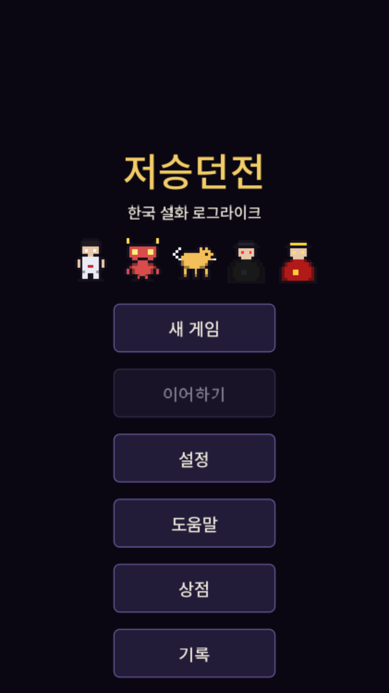
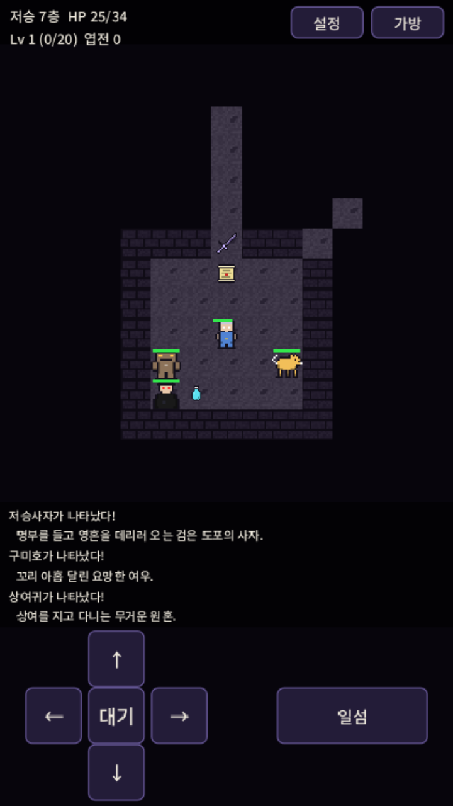

# 저승던전 (Jeoseung Dungeon)

한국 설화 기반 턴제 로그라이크 던전 크롤러. Godot 4.7.1 / GDScript, 모바일(Android/iOS) 타겟.
Shattered Pixel Dungeon에서 장르 영감만 받았고, 코드/아트/이름은 전부 오리지널입니다
(SPD는 GPL-3.0이라 코드·에셋을 가져오면 안 됩니다).

 

## 실행
- 웹에서 바로 하기(휴대폰 브라우저 포함): https://kekeke9628.github.io/JeoseungDungeon/ — `master` 에 병합될 때마다 `.github/workflows/pages.yml` 이 스모크 테스트·웹 빌드·내보낸 빌드 확인을 거쳐 자동으로 게시한다
- 에디터: Godot 4.7.1로 `project.godot` 열기 -> F5 (메인 메뉴에서 시작)
- 조작: 방향키/WASD 이동(적에게 부딪히면 공격), Space 대기, E/Q 기술, I 가방. 모바일은 화면 D-pad와 기술 버튼.
- 헤드리스 검증:
  - `Godot --headless --path . res://tests/SmokeTest.tscn` (로직 스모크 테스트, 실패 시 exit 1)
  - `Godot --headless --path . res://tests/BalanceSim.tscn` (클래스별 봇 밸런스 시뮬레이션, 약 5분)
  - 내보낸 빌드 확인: `godot --headless --export-pack "<프리셋>" /tmp/game.pck` 후 `godot --headless --main-pack /tmp/game.pck -s "$PWD/tests/export_check.gd"` (내보낸 게임에서 아이템·몬스터·직업이 실제로 불러와지는지. 소스에서 도는 스모크 테스트로는 못 잡는다)
- 린트: `gdlint <파일>` (gdtoolkit). Godot의 `--check-only --script` 는 오토로드를 못 찾아 이 프로젝트에선 오탐이 난다
- Claude Code on the web: `.claude/hooks/session-start.sh` 가 세션 시작 시 Godot 4.7.1·Pillow·numpy·gdtoolkit 을 설치하고 임포트 캐시를 만든다(처음 약 15초)

## 구현 현황
### Phase 1 (완료)
- 절차적 던전(방+복도), 턴제 전투, 아이템 감정, 장비, 레벨업, 자연 회복, 모바일 UI
- 데이터 주도: 아이템/몬스터/클래스는 `resources/**/*.tres` (스크립트 수정 없이 추가 가능)

### Phase 2 (완료)
- 클래스 3개: 무당(살풀이/회복), 화랑(일섬/3배 근접), 도사(뇌전/범위 피해) - 클래스별 기술과 재사용 대기
- 던전 20층, 5층마다 보스(쓰러뜨려야 계단이 열림): 어둑시니(5층), 강림차사(10층), 우두나찰(15층), 최종 보스 염라대왕(20층)
- 몬스터 19종(보스 4 포함), 아이템 37종(층별 등장 제한 `min_floor`), 축지/천리안 부적, 영약(최대 체력 영구 증가)
- 시야/안개(Bresenham 시야, 탐험한 곳 기억), 문(시야 차단, 밟으면 열림), 숨은 함정(가시/순간이동)
- 몬스터도 플레이어처럼 상하좌우로만 움직이고 바로 옆 4칸에서만 근접 공격(대각선에 선 몬스터는 옆으로 한 칸 붙어야 때림)
- 원거리 몬스터는 시야가 있어야 공격
- 저장/이어하기: 자동 저장(`user://save.json`), 사망/클리어 시 삭제(영구 사망)
- 메인 메뉴 + 직업 선택 화면
- 봇 시뮬레이션 기준 클리어율 약 48% (48판 중 23판: 무당 7/16, 화랑 11/16, 도사 5/16). 5·15층 보스(분노·중독·기절 포함)가 각각 다섯 판 안팎을 막는다(5층 5판, 15층 5판; 봇은 붉은 칸을 늘 비켜서므로 사람에게는 더 매울 수 있다). 보스를 더하기 전 약 69%, 시간제 효과 아이템(회춘탕·질풍주 등)이 들어가기 전 약 59%. 몬스터 공격력은 1.12배(`Monster.ATTACK_SCALE`). 계단을 밟기만 해도 내려가던 때는 봇이 층을 덜 치우고 내려가 약 40%였다. 봇은 쉬지 않으므로 배고픔 압박을 사람보다 덜 받고, 위험 구역은 잘 피해 다닌다

### Phase 3 (진행 중)
- 사운드: `python tools/gen_audio.py` 로 효과음 20종 + 음악 2곡(탐험/보스) 생성, 볼륨 설정 저장 (`AudioManager`, `SettingsManager`)
- 설정 화면, 첫 실행 도움말, 메인 메뉴 상점, 기록(통계) 화면
- 보스 소환 패턴: 보스는 체력이 절반 안팎으로 줄면 수하를 불러냄 (`MonsterData.summon_fraction/summon_count`)
- 보스 필살기(Shattered Pixel Dungeon 보스처럼 한 턴 예고): 칠 칸이 붉게 빛나고, 다음 턴에 2.5~3배로 내려친다. 어둑시니는 몸을 부풀렸다가 주변 8칸을 내리찍고, 우두나찰은 한 줄로 서면 뿔을 낮췄다가 최대 6칸을 돌진한다(비켜서면 벽에 박고 두 턴 비틀거림). 쓰고 나면 세 턴 쉬고, 투명한 상대는 노리지 못한다. 어둑시니의 평타는 중독(Goo의 산성 점액처럼), 우두나찰의 평타는 기절을 건다. 체력이 절반 아래로 떨어지면 분노해(붉게 빛남) 공격력 1.3배, 필살기 간격 두 턴, 벽에 박아도 한 턴만 비틀거린다 (`MonsterData.boss_move`, `enrage_fraction`, `Monster.danger_tiles`)
- 특수 지형: 우물(체력 절반 회복·해독)과 제단(최대 체력/공격/방어 중 하나 영구 강화), 한 번 쓰면 사라짐
- 층 중간 저장: 층 진입·10턴마다·앱을 내리거나 닫을 때 현재 층을 그대로(지형, 탐험한 곳, 바닥 물건, 몬스터와 체력, 알아챈 함정) 저장. 이어하면 멈췄던 자리에서 계속되고 층을 다시 뽑을 수 없다. 부활 가능한 사망 화면에서 앱을 꺼도 그 화면으로 돌아온다
- 함정 상호작용: 몬스터도 숨은 함정을 밟는다. 함정 옆 칸에 서면 확률로 이음새를 알아채고(제자리 대기로 재시도), 알아챈 함정은 화면에 표시되고 탭 이동이 피해 간다. 그 칸으로 적을 유인하면 대신 걸려들고, 보스는 함정을 부수고 지나간다. 천리안 부적은 층 전체의 함정까지 드러낸다
- 층 테마: 5층 단위 구간 이름(저승길/황천강/지옥문/염라전)과 타일 색조
- 상태이상: 중독(턴마다 피해)·기절(행동 손실). 일부 몬스터가 확률로 걸고 해독초로 치료
- 페이퍼돌 가방: 가운데에 내 캐릭터가 크게(9배) 서서 입은 장비를 그대로 입고 숨 쉬고, 6칸(머리·무기·옷·노리개·가락지·신발)이 양옆에서 해당 몸 부위로 선을 잇는다(IsoDungeonRPG의 인벤토리를 세로 화면에 맞게 옮김). 장착하면 아이콘이 가방에서 칸으로 날아가 닿는 순간 몸에 입혀지고, 칸이 튀고 그 부위가 반짝이며 캐릭터가 통통 튄다. 가방은 아이콘 격자이고, 칸 위 색 막대가 입는 자리를 알려 준다. 새 칸용 저승 테마 장비 12종(삿갓·흑립·주립, 노리개 3종, 가락지 3종, 짚신·목화·운혜)
- 입은 장비가 몸에 보인다: 장비 21종마다 24x24 겹그림(`tools/gear24.py`, `assets/sprites/gear/`)을 맨몸(`<직업>_bare.png`) 위에 쌓아, 지도 위 캐릭터와 가방 인형이 같은 모습이 된다. 무기는 오른손에 쥐고, 모자·옷·신발·노리개·가락지가 제자리에 입혀진다. 타이틀·직업 선택에는 시작 장비를 입은 모습이 나온다
- 배고픔(Shattered Pixel Dungeon 방식): 한 턴에 1씩 오르고, 300턴이면 '배고픔'(경고만), 450턴이면 '굶주림'(자연 회복이 멈추고 2턴마다 체력 1 감소). 층마다 음식이 딱 하나 놓인다(곶감 100·주먹밥 200·사잣밥 400턴, 가중치 40:45:15, 평균 약 190턴어치). 시작할 때 주먹밥 1개. 매번 쉬어서 체력을 다 채우는 플레이를 막는 장치. 수치는 `Player.HUNGRY/STARVING`, `Game.FOOD_WEIGHTS`
- 위험 구역(Shattered Pixel Dungeon의 독가스·냉기·불길): 2층부터 방 한두 곳에 독 늪(중독), 얼음 바닥(냉기: 그동안 세상이 두 번 움직인다), 불길(매 턴 화상)이 깔린다. 구간마다 나오는 종류가 다르고(저승길 독 늪, 황천강 얼음, 지옥문 불길...), 몬스터도 똑같이 당해(얼음 위 몬스터는 한 턴 쉼) 유인 전술이 된다. 보스는 무시하고, 부유 중이면 떠서 지나간다. 탭 이동은 피해 가고, 구역은 빛을 낸다(`HazardSystem`)
- 시간제 효과 아이템 5종(SPD의 회복·신속·심안·투명화·부양 물약): 회춘탕(60턴 매 턴 체력 +1), 질풍주(20턴 신속: 두 번 움직일 때 세상은 한 번), 심안탕(30턴 층 전체와 모든 적이 보임), 은신 부적(20턴, 바로 곁이 아니면 적이 못 알아챔, 공격하면 드러남), 부유 부적(25턴, 함정·위험 구역을 밟지 않음). 다른 물약·부적처럼 미감정으로 무작위 전리품에 섞인다(`ItemData.loot_weight`로 드물게). 상단 바 아래에 효과 아이콘과 남은 턴이 뜬다
- 계단은 밟기만 해서는 내려가지 않는다. 계단 위에 서면 '내려가기' 버튼(키보드 Enter)이 나타나고 눌러야 내려간다. 탭 이동으로 계단을 지나쳐도 그대로 걸어간다
- 공격 버튼(키보드 F): 바로 옆(상하좌우) 적 중 체력이 가장 낮은 적을 친다. 부딪혀 공격하기도 그대로
- 모션: 걷기 미끄러짐, 공격 돌진, 피격 흔들림, 사망 잔상, 대기 숨쉬기. 보이는 것만 바뀌고 턴은 애니메이션을 기다리지 않는다
- 전투 피드백(피해 숫자, 피격 번쩍임, 화면 흔들림), 탭 이동(자동 걷기, 적이 보이면 한 칸씩)
- 인앱결제 구조: `IAPManager` (부활 부적 소모성 / 후원자 팩 영구). 디버그 빌드에서만 모의 결제, 릴리스는 스토어 연결 전까지 구매 차단(안전장치)
- 출시 준비: 앱 아이콘, Compatibility 렌더러(저사양 안드로이드 호환), 내보내기 프리셋 템플릿, `docs/RELEASE.md`, `docs/PRIVACY_POLICY.md`, `docs/STORE_LISTING.md`
- 한글 폰트 번들: Noto Sans KR(OFL)을 KS X 1001 2,350자로 줄여(약 0.8MB) 기본 GUI 폰트로 사용 (`assets/fonts/`)
- 픽셀아트: `python tools/gen_sprites.py` 한 번으로 모두 생성한다(같은 결과가 나오도록 고정된 시드). 지도 위 모든 그림은 화면 2배(48px 칸에 24px 그림)로 그려 픽셀 크기가 같다
  - 캐릭터 20종(직업 3, 몬스터 17): 24x24, 대기 2프레임(숨쉬기, 귀신은 떠오르기). 도형으로 그리고 왼쪽 위 빛으로 5단계 명암을 자동으로 넣는다 (`tools/actors24.py`)
  - 타일: 층 구간마다 24x24 아틀라스 한 장(저승길 판석, 황천강 이끼 낀 푸른 돌, 지옥문 현무암과 불빛 균열, 염라전 마루와 단청). 바닥 4종, 벽 앞면·윗면, 드문 특수 벽, 문 두 방향, 계단, 우물·제단(2프레임), 함정, 바닥 장식. 위치표 `scripts/generation/TileAtlas.gd`도 함께 생성 (`tools/gen_tiles.py`)
  - 아이템 아이콘 33종: 16x16 (`tools/sprite_templates.py`)
  - UI: 옻칠·금테 버튼과 패널 9-slice, 버튼 아이콘 12종, 타이틀 배경(달밤의 홍살문) (`tools/gen_ui.py`)
  - 공용 도구 `tools/pixel_kit.py`: 어두울수록 차갑고 밝을수록 따뜻하게 색을 트는 명암 단계 등
- 조명: 칸당 1픽셀 광원 지도를 부드럽게 늘여 곱한다(`LightOverlay`). 플레이어 곁은 따뜻하고 시야 끝은 어둡고, 기억만 하는 곳은 푸르스름, 안 가 본 곳은 검다. 촛불·제단·계단이 주변을 밝히고 불빛이 살짝 일렁인다. 벽은 아래가 트이면 벽돌 앞면, 아니면 윗면과 밝은 테두리, 벽 밑 바닥에는 그림자
- 이펙트(`scripts/fx`): 맞으면 몬스터별 색으로 튀고(귀신은 푸른 혼), 죽으면 혼불이 오르고, 회복·줍기·레벨업, 살풀이 오방색 고리·일섬 칼 궤적·뇌전 번개, 함정 먼지·순간이동 소용돌이. 층 구간별로 먼지·물방울·불씨·금가루가 떠다닌다. 모든 연출은 자체 난수를 써서 게임의 주사위를 건드리지 않는다
- HUD: 체력·경험치 막대, 엽전, 배고픔 막대(든든함·보통·배고픔·굶주림과 남은 포만 %, 단계별 색), 독·기절 표시, 아이콘 버튼. 메시지 창은 최신 줄이 가장 밝다
- 타격감: 한 방이 들어가면 그림이 잠깐 멈칫하고(히트스톱, 강타는 더 길게), 맞은 쪽은 하얗게 번쩍이며 뒤로 밀려났다 돌아오고, 맞은 자리에 불꽃이 튄다. 공격은 뒤로 당겼다 찌른다. 피해 숫자는 크게 튀어나왔다 자리 잡고, 강타(최대 체력 30% 이상이나 처치)는 금빛 큰 숫자와 화면 흔들림, 무거운 타격음. 빗나가면 옆으로 비키며 "빗나감"이 뜬다. 흔들림·멈칫 모두 게임의 주사위를 건드리지 않는다
- 스프라이트가 없으면 색 사각형+글자로 자동 대체 (`SpriteLibrary`)

## 구조
- `autoloads/` 전역 상태 (GameState, DungeonState, TurnManager, SaveManager, ItemDatabase, MonsterDatabase, MessageBus)
- `scripts/core` Actor/Player/Game/CombatSystem/TrapSystem/Josa, `scripts/ai` Monster, `scripts/generation` 던전 생성/렌더/조명, `scripts/fx` 이펙트
- `scripts/items` ItemData/ItemEffects/SkillEffects, `scripts/ui` 코드로 만든 UI
- 스프라이트는 `assets/sprites/**`(생성 결과물)를 `SpriteLibrary`가 읽음. 더 좋은 아트로 교체하려면 같은 파일명·같은 크기의 PNG로 덮어쓰면 됨(캐릭터는 24x24 프레임을 가로로 이은 한 장, 타일은 `TileAtlas` 배치를 따르는 구간별 아틀라스)

## 다음 단계
- Phase 3 남은 것: 실제 스토어 결제 플러그인 연결, Android/iOS 실제 빌드(내보내기 템플릿·JDK·Android SDK 필요, iOS는 Mac 필요), 실기기 터치 테스트, 전문 아트/사운드로 교체(선택)
- 알려진 한계: 명중률 공식(`CombatSystem`: 75 + 명중 - 회피, 5~95%)이 명중 값(80~98) 때문에 거의 늘 95%에 걸려 명중·회피 능력치가 사실상 효과가 없다(새 장비도 그래서 공격·방어·체력만 올린다), 강제 종료(크래시 등)는 마지막 자동 저장까지만 남음(최대 10턴), 몬스터는 알아챈 함정도 피하지 못함(유인 전술의 전제),
  실기기(Android/iOS)에서는 아직 실행해 보지 않음
